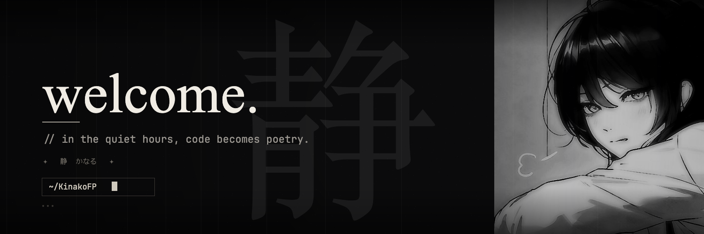

<div align="center">



<br/>
<br/>

<a href="https://github.com/KinakoFP">
  
</a>

<br/>
<br/>

</div>

<br/>

<div align="center">

<kbd>　 ❖ 　 W H I S P E R S 　 ❖ 　</kbd>

</div>

<br/>

<table align="center">
<tr>
<td width="50%" valign="top">

```yaml
identity:
  alias:     "~"
  pronouns:  they / them
  location:  somewhere quiet
  timezone:  UTC±?

current:
  building:  "—"
  reading:   "the unread tab"
  drinking:  black coffee
```

</td>
<td width="50%" valign="top">

```diff
@@ now playing @@
- noise
+ silence
+ keyboard clicks
+ rain on the window

! status: thinking
# wake me when it compiles
```

</td>
</tr>
</table>

<br/>
<br/>

<div align="center">

<kbd>　 ◈ 　 T E C H 　 S T A C K 　 ◈ 　</kbd>

<br/>
<br/>


&nbsp;

&nbsp;

&nbsp;

&nbsp;

&nbsp;

&nbsp;


<br/>
<br/>

</div>

<table align="center">
<tr>
<td align="right" valign="middle"><code>⚡&nbsp;&nbsp;languages</code></td>
<td align="left">


</td>
</tr>
<tr>
<td align="right" valign="middle"><code>🛠&nbsp;&nbsp;tools</code></td>
<td align="left">


</td>
</tr>
<tr>
<td align="right" valign="middle"><code>💻&nbsp;&nbsp;ides</code></td>
<td align="left">


</td>
</tr>
</table>

<br/>
<br/>

<div align="center">

<kbd>　 ✧ 　 S T A T S 　 ✧ 　</kbd>

<br/>
<br/>


&nbsp;

&nbsp;


<br/>
<br/>

<a href="https://github.com/KinakoFP">
  
</a>
<a href="https://github.com/KinakoFP">
  
</a>

<br/>

<a href="https://github.com/KinakoFP">
  
</a>
<a href="https://github.com/KinakoFP">
  
</a>

<br/>
<br/>

<a href="https://github.com/KinakoFP">
  
</a>

<br/>
<br/>

<a href="https://github.com/KinakoFP">
  
</a>

<br/>
<br/>


</div>

<br/>
<br/>

<div align="center">

<kbd>　 ☾ 　 Q U I E T &nbsp;&nbsp; H O U R S 　 ☽ 　</kbd>

<br/>
<br/>


<br/>
<br/>

<sub><code>// thanks for stopping by — don't be a stranger.</code></sub>

<br/>
<br/>

<kbd>　 ✦ 　 終 　 ✦ 　</kbd>

</div>
